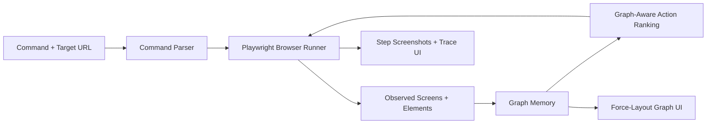

# GraphRAG Browser Agent

This project turns the earlier GraphRAG demo into a real browser-driven local app.

It now does three important things:

1. Runs a real browser session with Playwright using local Edge.
2. Accepts a natural-language command plus a target URL.
3. Stores screens, elements, transitions, and successful paths in a persistent graph memory layer.

The UI is no longer a fake state viewer. It now shows:

- real browser screenshots from each step,
- a command and target-URL control panel,
- a force-layout graph view with reduced overlap,
- a step-by-step execution journal,
- persistent GraphRAG memory across runs.

## Core Pieces

- `graphrag_agent/browser_runtime.py`
  Python wrapper that launches the Playwright browser runner.
- `graphrag_agent/browser_agent_runner.cjs`
  Node + Playwright runner that opens the browser, observes the page, chooses actions, and captures screenshots.
- `graphrag_agent/webapp.py`
  Backend state manager that merges browser-run observations into `GraphMemory`.
- `graphrag_agent/graph.py`
  The GraphRAG memory store for nodes, edges, successful paths, and retrieval helpers.
- `static/index.html`, `static/app.js`, `static/styles.css`
  The browser dashboard UI.
- `static/demo/`
  A polished local multi-page travel site the browser agent can control out of the box.

## How It Works



## Run It

From `D:\USC\graph_rag_agent`:

```powershell
python run_web.py
```

Then open:

```text
http://127.0.0.1:8010
```

If `8010` is already busy, you can use another port:

```powershell
$env:GRAPH_RAG_PORT='8011'
python run_web.py
```

Then open:

```text
http://127.0.0.1:8011
```

## Default Demo Commands

The default target is the built-in demo site:

```text
http://127.0.0.1:8010/demo/index.html
```

Useful commands:

- `Book a flight from San Francisco to New York`
- `Open travel deals`
- `Open my bookings`
- `Search for graph rag tutorials`
- `Fill email is sahil@example.com and password is secret123`

## What GraphRAG Is Doing Here

The graph stores:

- visited screens,
- visible elements,
- `screen -> contains -> element` relationships,
- `screen -> clicked -> element` relationships,
- `element -> leads_to -> screen` transitions,
- successful paths from earlier runs.

That improves behavior because the agent can score actions using:

1. text similarity to the command,
2. known destination pages,
3. successful past transitions,
4. approximate path distance to the goal.

## Run Tests

```powershell
python -m unittest discover -s tests -v
```

## CLI Demo

The older in-memory CLI MVP is still available:

```powershell
python run_demo.py
```

## Good Next Upgrades

If you want to push this further, the strongest next steps are:

1. Add a real LLM planner instead of heuristic action ranking.
2. Add VLM-based screenshot understanding instead of DOM-only observation.
3. Support long-lived browser sessions instead of one run per command.
4. Persist graph memory in Neo4j.
5. Add replay mode so a clicked graph path can re-run directly from memory.
