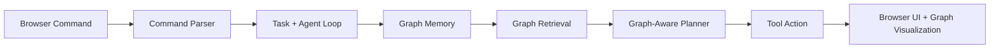

# GraphRAG Autonomous Agent Browser Demo

This project rebuilds the GraphRAG idea described in your PDFs as a runnable, browser-based Python demo.

The PDFs describe a system with four core ideas:

1. GraphRAG instead of plain vector RAG for persistent structured memory.
2. A multi-modal agent loop that can perceive, reason, and act.
3. Multi-hop reasoning over relationships instead of isolated chunk retrieval.
4. A web-task style benchmark similar to Mind2Web.

This codebase implements those ideas in a clean demo form:

- `graphrag_agent.graph.GraphMemory` stores screens, UI elements, and discovered transitions as a knowledge graph.
- `graphrag_agent.agent.GraphRAGAgent` runs the agent loop and uses graph retrieval before each action.
- `graphrag_agent.commands.CommandParser` turns free-text browser commands into tasks.
- `graphrag_agent.webapp.GraphRAGBrowserApp` exposes a browser-friendly app state and run API.
- `graphrag_agent.environment.DemoWebEnvironment` simulates a small web workflow with distractors, so memory matters.
- `run_web.py` launches the browser UI and `run_demo.py` keeps the original CLI demo.

## What This Project Is

This is a faithful MVP of the architecture from your project description, not a literal reproduction of the original benchmark numbers in the PDFs.

It is designed to help you:

- understand how GraphRAG works,
- explain the project clearly in interviews,
- extend it into a real LLM + VLM system later.

## Architecture



## Why GraphRAG Helps

Standard RAG is good when each question is mostly independent.

Agents are different:

- they act across many steps,
- they need to remember what they already saw,
- they often need multi-hop reasoning,
- they benefit from storing relationships, not just raw text chunks.

In this demo, the memory graph stores:

- screens,
- inputs and buttons,
- discovered transitions such as `button -> next screen`,
- filled fields and successful action paths.

That means the agent can improve on later runs because it remembers which UI element leads where and which routes previously succeeded.

## Project Layout

```text
graph_rag_agent/
|-- graphrag_agent/
|   |-- __init__.py
|   |-- agent.py
|   |-- commands.py
|   |-- environment.py
|   |-- graph.py
|   |-- models.py
|   `-- webapp.py
|-- static/
|   |-- app.js
|   |-- index.html
|   `-- styles.css
|-- tests/
|   |-- test_agent.py
|   |-- test_commands.py
|   |-- test_graph.py
|   `-- test_webapp.py
|-- pyproject.toml
|-- run_demo.py
`-- run_web.py
```

## Run The Browser App

From this folder:

```powershell
python run_web.py
```

Then open:

```text
http://127.0.0.1:8010
```

You can type commands like:

- `Book a flight from San Francisco to New York`
- `Open travel deals`
- `Open my bookings`

The browser app shows:

- parsed task intent,
- final simulated browser state,
- step-by-step agent trace,
- a live graph visualization,
- persistent graph memory across runs.

## Run The CLI Demo

```powershell
python run_demo.py
```

The CLI demo still runs the same task twice:

- episode 1 explores and makes one avoidable detour,
- episode 2 reuses graph memory and reaches the goal faster.

## Run Tests

```powershell
python -m unittest discover -s tests -v
```

## Why The Graph Makes It More Accurate

This browser version now ranks actions using more than label matching:

1. It remembers successful transitions such as `Plan Trip -> Flight Planner`.
2. It boosts actions whose discovered destinations are already on a known path to the goal.
3. It reinforces edges that were part of successful runs.

That is the GraphRAG advantage in this demo: the graph is not just visualized, it actively changes action selection.

## How This Maps Back To Your Resume Story

From your PDFs, the project story was:

- GraphRAG for memory and structured reasoning,
- vision-language perception for UI understanding,
- agent management across components,
- better behavior than ReAct/Reflexion because the memory persists across steps.

This browser MVP mirrors that story like this:

- `Observation` objects stand in for a VLM output.
- `GraphMemory` is the persistent memory layer.
- `GraphRAGAgent` coordinates perception, retrieval, planning, and actions.
- `GraphRAGBrowserApp` wraps that flow into something you can demonstrate live in a browser.

## Good Next Upgrades

If you want to turn this into a stronger portfolio project, the next upgrades are:

1. Replace the demo environment with a browser automation layer.
2. Replace the rule-based planner with an LLM policy.
3. Replace structured observations with screenshot-to-JSON VLM extraction.
4. Add vector retrieval for node descriptions plus graph traversal for hybrid retrieval.
5. Persist the graph in Neo4j or a graph database instead of JSON or in-memory storage.
